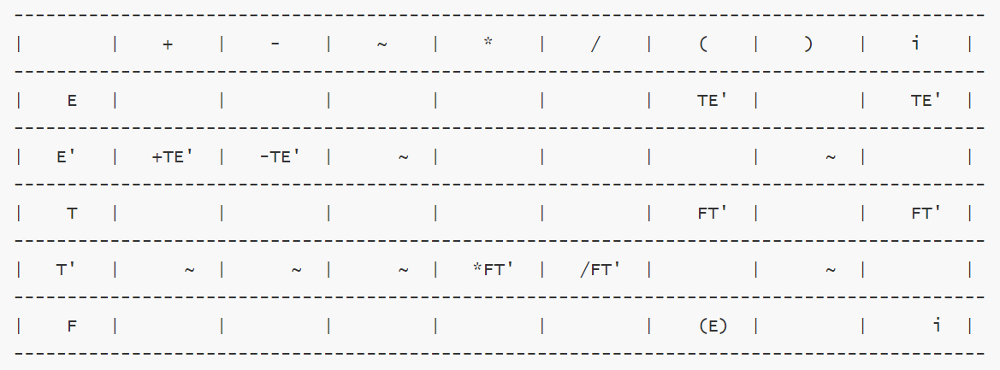

# 词法分析器实验报告

###### 姓名：马嘉骥		班级：2018211303		学号：2018211149


## 实验内容及要求

- **题目：语法分析程序的设计与实现**
- 实验内容：编写语法分析程序，实现对算术表达式的语法分析。要求所分析算数表达式由如下的文法产生

$$
\begin{align*}
	& E \rightarrow E+T | E–T | T \\
	& T \rightarrow T*F | T/F | F \\
	& F \rightarrow (E) | num
\end{align*}
$$

- 实验要求：在对输入的算术表达式进行分析的过程中，依次输出所采用的产生式。

	- 方法1：编写递归调用程序实现自顶向下的分析。
	- 方法2：编写LL(1)语法分析程序，要求如下。
		-  (1) 编程实现算法4.2，为给定文法自动构造预测分析表。 
		-  (2) 编程实现算法4.1，构造LL(1)预测分析程序 。 
	- 方法3：编写语法分析程序实现自底向上的分析，要求如下。
		-  (1) 构造识别该文法所有活前缀的DFA。 
		-  (2) 构造该文法的LR分析表。 
		-  (3) 编程实现算法4.3，构造LR分析程序。 
	- 方法4：利用YACC自动生成语法分析程序，调用LEX自动生成的词法分 析程序。 

## 实验平台

* CLion
* C++11

## 项目结构

* SyntacticAnalysis
	* WF.h
	* FIRST.cpp
	* FIRST.h
	* FOLLOW.cpp
	* FOLLOW.h
	* TableGen.cpp
	* TableGen.h
	* Analyse.cpp
	* Analyse.h
	* Main.cpp
	* Main.h
	* CMakeLists.txt
	* Report.md

## 算法代码

* 能力有限，仅实现了LL(1)分析程序。

### 构造FIRST集

- 如果$X_i∈V_t$，那么$FIRST(α)=FIRST(X_i)=\{X_i\}$，那么$FIRST(α)=FIRST(Xi)=\{Xi\}$
- 如果$X_i∈V_n$，因为不存在左递归，所以$X_i=a.......|ϵ$，那么$FIRST(X_i)=\{a,ϵ,FIRST(Xi+1)\}$
- 只要$X_{i−1}$不包含$ϵ$，那么$X_i$不可能影响$FIRST(α)$
- 那么记录每个$a∈V$，然后进行深度优先搜索，将所有的状态填满。

```c++
#include "FIRST.h"
#include "WF.h"

extern map<string, set<char> > FIRST;
extern map<string, set<char> > FOLLOW;
extern map<string, int> VN_dic;
extern vector<WF> VN_set;
extern bool used[MAX];
extern vector<map<char, string> > predict_table;

void dfs(int x) {
    if (used[x]) return;
    used[x] = true;
    string &left = VN_set[x].left;
    set<string> &right = VN_set[x].right;
    auto it = right.begin();
    for (; it != right.end(); it++)
        for (int i = 0; i < it->length(); i++) {
            if (!isupper(it->at(i)) && it->at(i) != '\'') {
                FIRST[left].insert(it->at(i));
                break;
            }
            if (isupper(it->at(i))) {
                int y;
                if (i != it->length() - 1 && it->at(i + 1) == '\'')
                    y = VN_dic[it->substr(i, 2)] - 1;
                else y = VN_dic[it->substr(i, 1)] - 1;
                string &tleft = VN_set[y].left;
                dfs(y);
                set<char> &temp = FIRST[tleft];
                auto it1 = temp.begin();
                bool flag = true;
                for (; it1 != temp.end(); it1++) {
                    if (*it1 == '~') flag = false;
                    FIRST[left].insert(*it1);
                }
                if (flag) break;
            } else continue;
        }
}

void make_first() {
    memset(used, 0, sizeof(used));
    for (int i = 0; i < VN_set.size(); i++)
        dfs(i);
#define DEBUG
#ifdef DEBUG
    puts("FIRST");
    auto it = FIRST.begin();
    for (; it != FIRST.end(); it++) {
        printf("$FIRST(%s)=\\{", it->first.c_str());
        set<char> &temp = it->second;
        auto it1 = temp.begin();
        bool flag = false;
        for (; it1 != temp.end(); it1++) {
            if (flag) printf(",");
            printf("%c", *it1);
            flag = true;
        }
        puts("\\}$");
    }
#endif
}
```

```c++
#ifndef SYNTACTICANALYSIS_FIRST_H
#define SYNTACTICANALYSIS_FIRST_H

#include <iostream>
#include <cstring>
#include <cstdio>
#include <algorithm>
#include <cstdlib>
#include <vector>
#include <string>
#include <cctype>
#include <map>
#include <set>

#define MAX 507

using namespace std;

void make_first();

#endif //SYNTACTICANALYSIS_FIRST_H
```

### 构造FOLLOW集

* 设$S,A,B∈V_n$，那么连续使用如下规则，直至$FOLLOW$不再发生变化：
  * S为标识符，那么$FOLLOW(S)$包含“#”。
  * 若$A \rightarrow αBβ$，那么$FOLLOW(B)+=FIRST(B)−{ϵ}$。
  * 若$A \rightarrow αB$或者$A \rightarrow αBβ$且$β \rightarrow ∗ϵ$，那么$FOLLOW(B)+=FOLLOW(A)$。

```c++
#include "FOLLOW.h"
#include "WF.h"

extern map<string, set<char> > FIRST;
extern map<string, set<char> > FOLLOW;
extern map<string, int> VN_dic;
extern vector<WF> VN_set;
extern bool used[MAX];
extern vector<map<char, string> > predict_table;

void append(const string &str1, const string &str2) {
    set<char> &from = FOLLOW[str1];
    set<char> &to = FOLLOW[str2];
    auto it = from.begin();
    for (; it != from.end(); it++)
        to.insert(*it);
}

void make_follow() {
    while (true) {
        bool goon = false;
        for (int i = 0; i < VN_set.size(); i++) {
            string &left = VN_set[i].left;
            set<string> &right = VN_set[i].right;
            auto it = right.begin();
            for (; it != right.end(); it++) {
                bool flag = true;
                const string &str = *it;
                for (int j = it->length() - 1; j >= 0; j--) {
                    if (str[j] == '\'') {
                        int x = VN_dic[it->substr(j - 1, 2)] - 1;
                        if (flag) {
                            int tt = FOLLOW[it->substr(j - 1, 2)].size();
                            append(left, it->substr(j - 1, 2));
                            int tt1 = FOLLOW[it->substr(j - 1, 2)].size();
                            if (tt1 > tt) goon = true;
                            if (!VN_set[x].right.count("~"))
                                flag = false;
                        }
                        for (int k = j + 1; k < it->length(); k++) {
                            if (isupper(str[k])) {
                                string id;
                                if (k != it->length() - 1 && str[k + 1] == '\'')
                                    id = it->substr(k, 2);
                                else id = it->substr(k, 1);
                                set<char> &from = FIRST[id];
                                set<char> &to = FOLLOW[it->substr(j - 1, 2)];
                                int tt = to.size();
                                auto it1 = from.begin();
                                for (; it1 != from.end(); it1++)
                                    if (*it1 != '~')
                                        to.insert(*it1);
                                int tt1 = FOLLOW[it->substr(j - 1, 2)].size();
                                if (tt1 > tt) goon = true;
                                if (!VN_set[VN_dic[id] - 1].right.count("~"))
                                    break;
                            } else if (str[k] != '\'') {
                                int tt = FOLLOW[it->substr(j - 1, 2)].size();
                                FOLLOW[it->substr(j - 1, 2)].insert(str[k]);
                                int tt1 = FOLLOW[it->substr(j - 1, 2)].size();
                                if (tt1 > tt)
                                    goon = true;
                                break;
                            } else continue;
                        }
                        j--;
                    } else if (isupper(str[j])) {
                        int x = VN_dic[it->substr(j, 1)] - 1;
                        if (flag) {
                            int tt = FOLLOW[it->substr(j, 1)].size();
                            append(left, it->substr(j, 1));
                            if (!VN_set[x].right.count("~"))
                                flag = false;
                            int tt1 = FOLLOW[it->substr(j, 1)].size();
                            if (tt1 > tt) goon = true;
                        }
                        for (int k = j + 1; k < it->length(); k++) {
                            if (isupper(str[k])) {
                                string id;
                                if (k != it->length() - 1 && str[k + 1] == '\'')
                                    id = it->substr(k, 2);
                                else id = it->substr(k, 1);
                                set<char> &from = FIRST[id];
                                set<char> &to = FOLLOW[it->substr(j, 1)];
                                auto it1 = from.begin();
                                int tt = FOLLOW[it->substr(j, 1)].size();
                                for (; it1 != from.end(); it1++)
                                    if (*it1 != '~')
                                        to.insert(*it1);
                                int tt1 = FOLLOW[it->substr(j, 1)].size();
                                if (tt1 > tt) goon = true;
                                if (!VN_set[VN_dic[id] - 1].right.count("~"))
                                    break;
                            } else if (str[k] != '\'') {
                                int tt = FOLLOW[it->substr(j, 1)].size();
                                FOLLOW[it->substr(j, 1)].insert(str[k]);
                                int tt1 = FOLLOW[it->substr(j, 1)].size();
                                if (tt1 > tt) goon = true;
                                break;
                            } else continue;
                        }
                    } else flag = false;
                }
            }
        }
        if (!goon) break;
    }
#define DEBUG
#ifdef DEBUG
    puts("FOLLOW");
    auto it = FOLLOW.begin();
    for (; it != FOLLOW.end(); it++) {
        printf("$FOLLOW(%s)=\\{", it->first.c_str());
        set<char> &temp = it->second;
        temp.insert('#');
        auto it1 = temp.begin();
        bool flag = false;
        for (; it1 != temp.end(); it1++) {
            if (flag) printf(",");
            printf("%c", *it1);
            flag = true;
        }
        puts("\\}$");
    }
#endif
}
```

```c++
#ifndef LEX_FOLLOW_H
#define LEX_FOLLOW_H

#include <iostream>
#include <cstring>
#include <cstdio>
#include <algorithm>
#include <cstdlib>
#include <vector>
#include <string>
#include <cctype>
#include <map>
#include <set>

#define MAX 507

using namespace std;

void make_follow();

#endif //LEX_FOLLOW_H
```

### 构造预测分析表

* 若$a \in FIRST(\alpha_i)$，$M[A,a]=A \rightarrow \alpha_i$
* 若$\alpha_i = \varepsilon | \alpha_i \rightarrow^+ \varepsilon$，$a \in FOLLOW(A)$，$M[A,a]=A\rightarrow \alpha_i$
* 没有定义的都标为$error$。

```c++
#include "TableGen.h"
#include "WF.h"

extern map<string, set<char> > FIRST;
extern map<string, set<char> > FOLLOW;
extern map<string, int> VN_dic;
extern vector<WF> VN_set;
extern bool used[MAX];
extern vector<map<char, string> > predict_table;

//检查一个字符是否属于一个字符串的FIRST集合
bool check_first(const string &text, char ch) {
    for (int i = 0; i < text.length(); i++) {
        bool hasEmpty = false;
        if (!isupper(text[i]) && text[i] != '\'') {
            if (text[i] != ch) return false;
            else return true;
        } else if (isupper(text[i])) {
            string temp;
            if (i != text.length() - 1 && text[i + 1] == '\'')
                temp = text.substr(i, 2);
            else
                temp = text.substr(i, 1);
            set<char> &dic = FIRST[temp];
            auto it = dic.begin();
            for (; it != dic.end(); it++) {
                if (*it == '~') hasEmpty = true;
                if (*it == ch) return true;
            }
            if (!hasEmpty) break;
        } else continue;
    }
    return false;
}

//检查一个字符是否属于一个字符串的FOLLOW集合
bool check_follow(const string &text, char ch) {
    set<char> &dic = FOLLOW[text];
    auto it = dic.begin();
    for (; it != dic.end(); it++)
        if (*it == ch) return true;
    return false;
}

void make_table() {
    map<char, string> temp;
    vector<char> letter;
    bool vis[500];
    memset(vis, 0, sizeof(vis));
    for (auto &i : VN_set) {
        set<string> &right = i.right;
        auto it = right.begin();
        for (; it != right.end(); it++)
            for (char j : *it)
                if (!isupper(j) && j != '\'') {
                    if (vis[j]) continue;
                    vis[j] = true;
                    letter.push_back(j);
                }
    }
    for (auto &i : VN_set) {
        temp.clear();
        string &left = i.left;
        set<string> &right = i.right;
        auto it = right.begin();
        for (; it != right.end(); it++)
            for (char &j : letter) {
                //cout << *it << " " <<  letter[j] << endl;
                if (check_first(*it, j)) {
                    //cout << "YES" << endl;
                    temp[j] = *it;
                }
                if (it->at(0) == '~' && check_follow(left, j))
                    temp[j] = *it;
            }
        predict_table.push_back(temp);
    }
#define DEBUG
#ifdef DEBUG
    for (int i = 0; i <= (letter.size() + 1) * 10; i++)
        printf("-");
    puts("");
    printf("|%9s", "|");
    for (char i : letter)
        printf("%5c%5s", i, "|");
    puts("");
    for (int i = 0; i <= (letter.size() + 1) * 10; i++)
        printf("-");
    puts("");
    for (int i = 0; i < VN_set.size(); i++) {
        printf("|%5s%4s", VN_set[i].left.c_str(), "|");
        for (char &j : letter)
            if (predict_table[i].count(j))
                printf("%7s%3s", predict_table[i][j].c_str(), "|");
            else printf("%10s", "|");
        puts("");
        for (int j = 0; j <= (letter.size() + 1) * 10; j++)
            printf("-");
        puts("");
    }
#endif
}
```

```c++
#ifndef LEX_TABLEGEN_H
#define LEX_TABLEGEN_H

#include <iostream>
#include <cstring>
#include <cstdio>
#include <algorithm>
#include <cstdlib>
#include <vector>
#include <string>
#include <cctype>
#include <map>
#include <set>

#define MAX 507

using namespace std;

void make_table();

#endif //LEX_TABLEGEN_H
```

```c++
#ifndef LEX_TABLEGEN_H
#define LEX_TABLEGEN_H

#include <iostream>
#include <cstring>
#include <cstdio>
#include <algorithm>
#include <cstdlib>
#include <vector>
#include <string>
#include <cctype>
#include <map>
#include <set>

#define MAX 507

using namespace std;

void make_table();

#endif //LEX_TABLEGEN_H
```

### 分析

- 若$X = a = ‘\#’$，则宣布分析成功，停止分析过程。
- 若$X = a ≠‘\#’$，则把$X$从$STACK$栈顶弹出，让$a$指向下一个输入符号。
- 若$X$是一个非终结符，则查看分析表$M$。
	- 若$M[X,a]$中存放着关于$X$的一个产生式，那么，先把$X$弹出$STACK$栈顶，然后把产生式的右部符号串按反序一一推进$STACK$栈（若右部符号为$ε$，则意味着不推东西进栈）。
	- 若$M[X,a]$中存放着$error$，则出错。

```c++
#include "Analyse.h"
#include "TableGen.h"
#include "FIRST.h"
#include "FOLLOW.h"
#include "WF.h"

extern map<string, set<char> > FIRST;
extern map<string, set<char> > FOLLOW;
extern map<string, int> VN_dic;
extern vector<WF> VN_set;
extern bool used[MAX];
extern vector<map<char, string> > predict_table;

void print(int steps, stack<string> stk, string src, const string &wf, int x) {
    printf("%-10d", steps);
    string out;
    while (!stk.empty()) {
        out = stk.top() + out;
        stk.pop();
    }
    printf("#%-9s", out.c_str());
    out = "";
    for (int i = x; i < src.length(); i++)
        out += src[i];
    printf("%-10s", (out + "#").c_str());
    printf("%-10s\n", wf.c_str());
}

void analyse(const string &src) {
    stack<string> stk;
    stk.push("E");
    int steps = 0;
    int idx = 0;
    printf("%-14s%-14s%-14s%-14s\n", "步骤", "符号栈", "输入串", "所用产生式");
    while (!stk.empty()) {
        string u = stk.top();
        string tmp;
        stk.pop();
        if (!isupper(u[0])) {
            if (idx == src.length() && u[0] == '~');
            else if (src[idx] == u[0])
                idx++;
        } else {
            int x = VN_dic[u] - 1;
            tmp = predict_table[x][src[idx]];
            for (int i = tmp.length() - 1; i >= 0; i--) {
                if (tmp[i] == '\'') {
                    string v = tmp.substr(i - 1, 2);
                    stk.push(v);
                    i--;
                } else {
                    string v = tmp.substr(i, 1);
                    stk.push(v);
                }
            }
            tmp = u + "->" + tmp;
        }
        print(steps++, stk, src, tmp, idx);
    }
}
```

```c++
#ifndef LEX_ANALYSE_H
#define LEX_ANALYSE_H

#include <iostream>
#include <cstring>
#include <cstdio>
#include <algorithm>
#include <cstdlib>
#include <vector>
#include <string>
#include <cctype>
#include <stack>
#include <map>
#include <set>

using namespace std;

void analyse(const string &src);

#endif //LEX_ANALYSE_H
```

### 驱动程序

```c++
#include "Analyse.h"
#include "TableGen.h"
#include "FIRST.h"
#include "FOLLOW.h"
#include "WF.h"
#include "Main.h"

map<string, set<char> > FIRST;
map<string, set<char> > FOLLOW;
map<string, int> VN_dic;
vector<WF> VN_set;
bool used[MAX];
vector<map<char, string> > predict_table;

int main() {
    int n;
    char s[MAX];
    while (~scanf("%d", &n)) {
        for (int i = 0; i < n; i++) {
            scanf("%s", s);
            int len = strlen(s), j;
            for (j = 0; j < len; j++)
                if (s[j] == '-') break;
            s[j] = 0;
            if (!VN_dic[s]) {
                VN_set.emplace_back(s);
                VN_dic[s] = VN_set.size();
            }
            int x = VN_dic[s] - 1;
            VN_set[x].insert(s + j + 2);
        }
        make_first();
        make_follow();
        make_table();
        string in;
        std::cin >> in;
        analyse(in);
    }
}
```

```c++
#ifndef SYNTACTICANALYSIS_MAIN_H
#define SYNTACTICANALYSIS_MAIN_H

#include <iostream>
#include <cstring>
#include <cstdio>
#include <algorithm>
#include <cstdlib>
#include <vector>
#include <string>
#include <cctype>
#include <stack>
#include <map>
#include <set>

using namespace std;

#endif //SYNTACTICANALYSIS_MAIN_H
```

## 运行结果

### 输入

* 输入手工转换过的文法、待分析的符号串：

```
10
E->TE'
E'->+TE'
E'->-TE'
E'->~
T->FT'
T'->*FT'
T'->/FT'
T'->~
F->(E)
F->i

(i+i*i)
```

### 输出

* 程序输出LATEX格式的$FIRST$和$FOLLOW$集：

```
FIRST
$FIRST(E)=\{(,i\}$
$FIRST(E')=\{+,-,~\}$
$FIRST(F)=\{(,i\}$
$FIRST(T)=\{(,i\}$
$FIRST(T')=\{*,/,~\}$
FOLLOW
$FOLLOW(E)=\{#,)\}$
$FOLLOW(E')=\{#,)\}$
$FOLLOW(F)=\{#,),*,+,-,/\}$
$FOLLOW(T)=\{#,),+,-\}$
$FOLLOW(T')=\{#,),+,-\}$
```

#### FIRST

$FIRST(E)=\{(,i\}$
$FIRST(E')=\{+,-,~\}$
$FIRST(F)=\{(,i\}$
$FIRST(T)=\{(,i\}$
$FIRST(T')=\{*,/,~\}$

#### FOLLOW

$FOLLOW(E)=\{\#,)\}$
$FOLLOW(E')=\{\#,)\}$
$FOLLOW(F)=\{\#,),*,+,-,/\}$
$FOLLOW(T)=\{\#,),+,-\}$
$FOLLOW(T')=\{\#,),+,-\}$

#### 分析表



#### 分析过程

```
步骤        	符号栈     	 输入串	   产生式
0             #E'T           (i+i*i)#      E->TE'
1             #E'T'F         (i+i*i)#      T->FT'
2             #E'T')E(       (i+i*i)#      F->(E)
3             #E'T')E        i+i*i)#
4             #E'T')E'T      i+i*i)#       E->TE'
5             #E'T')E'T'F    i+i*i)#       T->FT'
6             #E'T')E'T'i    i+i*i)#       F->i
7             #E'T')E'T'     +i*i)#
8             #E'T')E'~      +i*i)#        T'->~
9             #E'T')E'       +i*i)#
10            #E'T')E'T+     +i*i)#        E'->+TE'
11            #E'T')E'T      i*i)#
12            #E'T')E'T'F    i*i)#         T->FT'
13            #E'T')E'T'i    i*i)#         F->i
14            #E'T')E'T'     *i)#
15            #E'T')E'T'F*   *i)#          T'->*FT'
16            #E'T')E'T'F    i)#
17            #E'T')E'T'i    i)#           F->i
18            #E'T')E'T'     )#
19            #E'T')E'~      )#            T'->~
20            #E'T')E'       )#
21            #E'T')~        )#            E'->~
22            #E'T')         )#
23            #E'T'          #
24            #E'            #             T'->
25            #              #             E'->
```


<style type="text/css">
    h1 { counter-reset: h2counter; }
    h2 { counter-reset: h3counter; }
    h3 { counter-reset: h4counter; }
    h4 { counter-reset: h5counter; }
    h5 { counter-reset: h6counter; }
    h6 { }
    h2:before {
      counter-increment: h2counter;
      content: counter(h2counter) ".\0000a0\0000a0";
    }
    h3:before {
      counter-increment: h3counter;
      content: counter(h2counter) "."
                counter(h3counter) ".\0000a0\0000a0";
    }
    h4:before {
      counter-increment: h4counter;
      content: counter(h2counter) "."
                counter(h3counter) "."
                counter(h4counter) ".\0000a0\0000a0";
    }
    h5:before {
      counter-increment: h5counter;
      content: counter(h2counter) "."
                counter(h3counter) "."
                counter(h4counter) "."
                counter(h5counter) ".\0000a0\0000a0";
    }
    h6:before {
      counter-increment: h6counter;
      content: counter(h2counter) "."
                counter(h3counter) "."
                counter(h4counter) "."
                counter(h5counter) "."
                counter(h6counter) ".\0000a0\0000a0";
    }
</style>